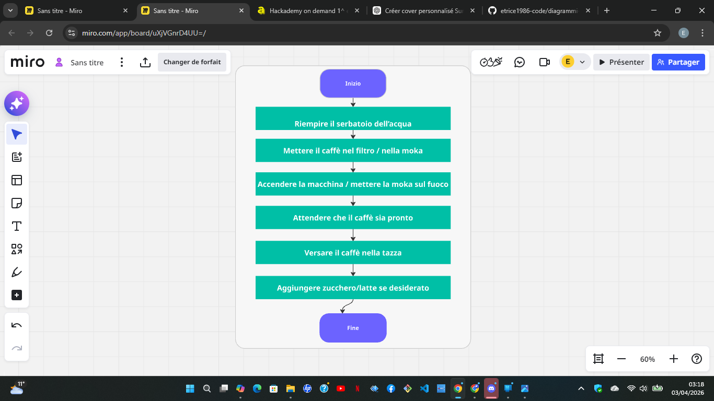

# Diagrammi di Programmazione

Raccolta degli esercizi di diagrammi di flusso realizzati durante il corso Hackademy.  
Ogni esercizio è rappresentato tramite diagramma e organizzato in modo chiaro all’interno della repository.

---

## 📁 Contenuto della repository

- **Esercizio 1** – Diagramma di flusso base  
- **Esercizio 2** – Diagramma con condizioni  
- **Esercizio 3** – Processo “Come fare il caffè” con ciclo e condizione

---

## 📊 Diagrammi

- [Esercizio 1](esercizio1.png.png)  
- [Esercizio 2](esercizio2.png.png)  
- [Esercizio 3](screenshots/esercizio3.png)

---

## 🔍 Anteprima dell’esercizio 3

---

## 📂 Struttura delle cartelle
